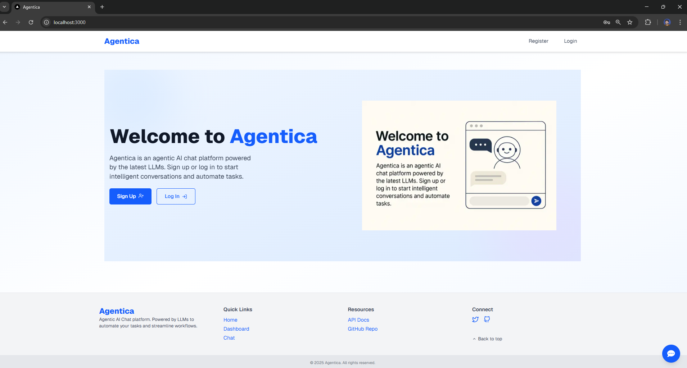
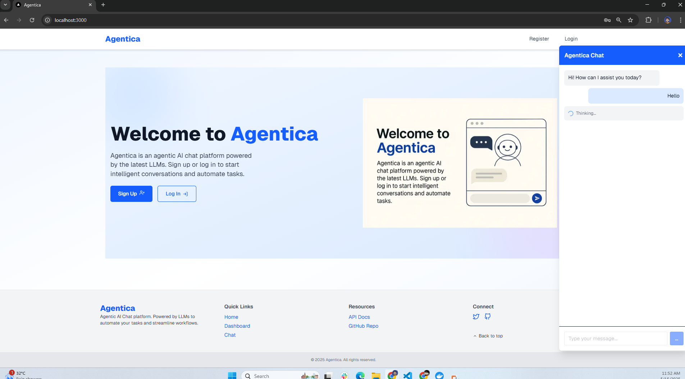
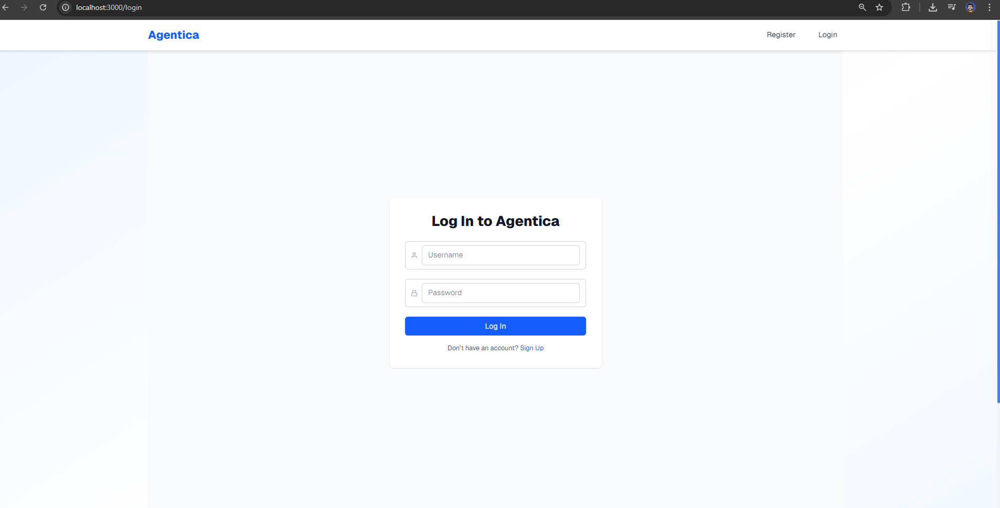
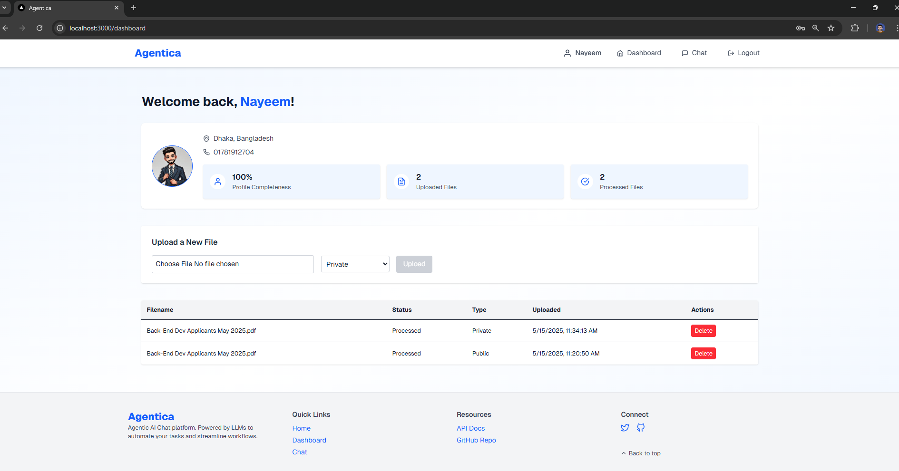
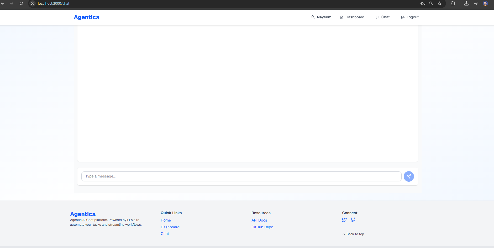
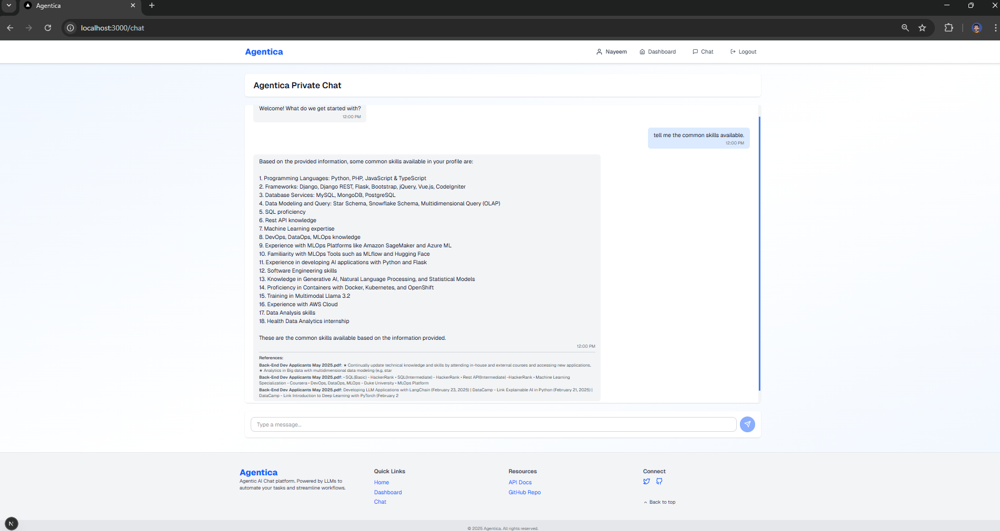

# Agentica

## Overview  
Agentica is an agentic AI chat platform powered by large language models, featuring user authentication, profile management, and real-time chat sessions.

## Clone from GitHub  
```bash
git clone https://github.com/NoManNayeem/Agentica.git
cd agentica
```

## Install and Run Locally (Backend & Frontend)

### Backend:
```bash
cd backend
python -m venv venv
source venv/bin/activate      # Linux/macOS
venv\Scripts\activate       # Windows
pip install -r requirements.txt
python manage.py migrate
python manage.py runserver
```

### Frontend:
```bash
cd frontend
npm install
npm run dev
```

## Install and Run with Docker Compose
```bash
docker-compose up --build
```

- **Backend**: http://localhost:8000/  
- **Frontend**: http://localhost:3000/

## Screenshots

<div style="display: grid; grid-template-columns: repeat(auto-fit, minmax(200px, 1fr)); gap: 16px;">
  
  
  
  
  
  
</div>